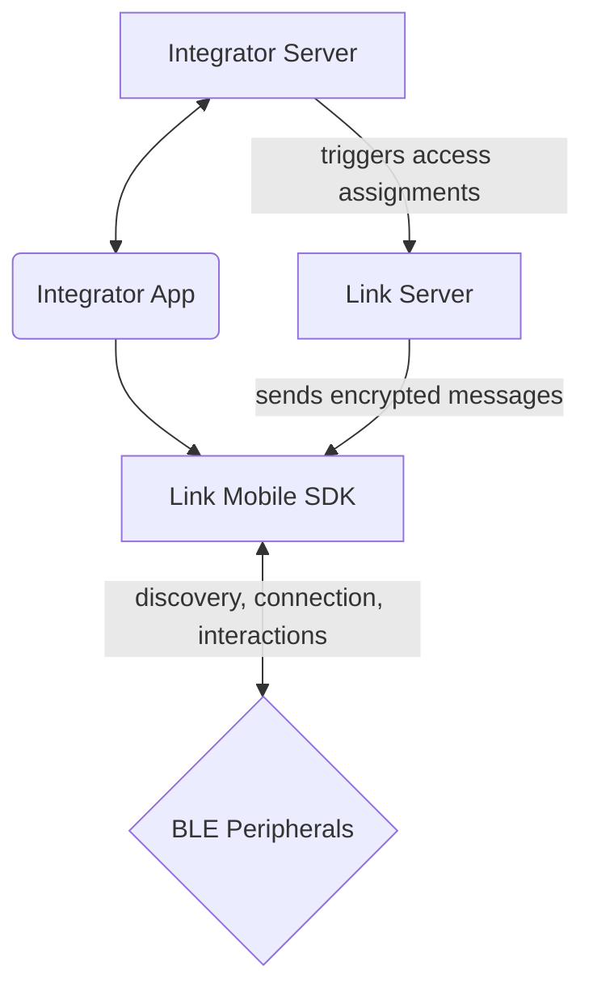

# Link Mobile SDK 2.5.1
The Link Mobile SDK connects Last Lock's hardware ecosystem to mobile applications. It gives integrators a simple interface for BLE device discovery, connection management, and lock control without needing a custom Bluetooth implementation. The SDK maintains a background proxy connection so Last Lock hardware can communicate securely with the cloud.

By integrating this SDK, developers can:
- Seamlessly discover and establish connectivity with Last Lock devices over BLE.
- Perform secure credential exchange with supported locks.
- Focus on application logic instead of protocol and connectivity details.

For integration guides (setup, permissions, discovery) and links to the **hosted API reference** on GitHub Pages, see:
- iOS: https://developer.lastlock.com/docs/api/link-mobile-sdk-iOS
- Android: https://developer.lastlock.com/docs/api/link-mobile-sdk-android

**Example apps** (iOS, React Native): [github.com/last-lock/link-mobile-sdk-prod/tree/main/examples](https://github.com/last-lock/link-mobile-sdk-prod/tree/main/examples). For React Native, see `examples/ReactNative` in that tree and `LINKMOBILE_INTEGRATION.md` in the TimeKeeper+LinkMobile project.

Hosted API reference (example Pages site from the SDK docs pipeline): https://animated-adventure-8er2kgy.pages.github.io/sdk-api/

